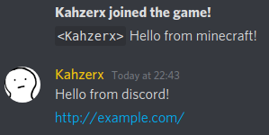

# Discord to minecraft chatbridge

## InGame Commands
```
/discord (information about the chatBridge status)
/discord setBot <token> <channelId> (to set the information into the configuration file)
/discord start (to start the chatBridge)
/discord stop (to stop the chatBridge)
```

## Screenshots



